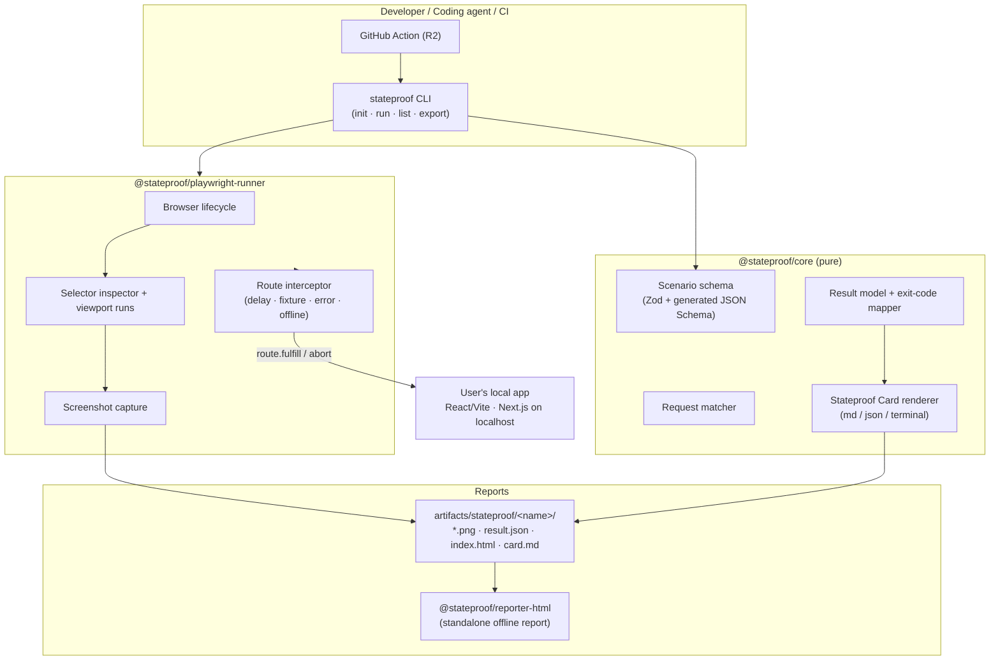
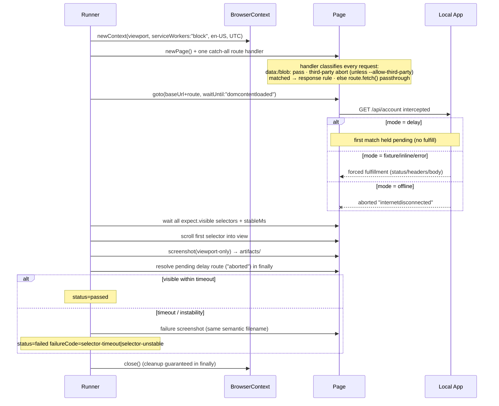
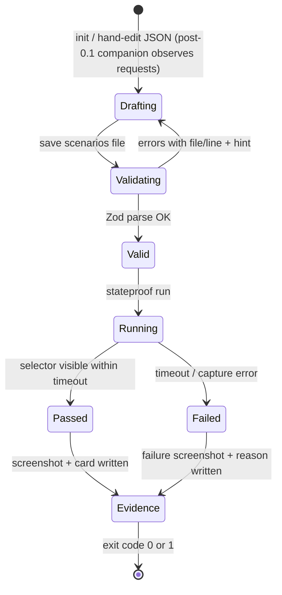

# Stateproof — Architecture

> Source of truth for how Stateproof is built. Derived from the PRD v1.0 and current (2026) best practices for Playwright interception, agent-facing CLIs, and TypeScript monorepos.

| Field | Value |
|---|---|
| Status | Active |
| Scope | Release 1 (CLI core) → Release 2 (GitHub Action) |
| Related docs | `prd.txt` / PRD, `userflow.md`, `design.md`, `rules.md` |

---

## 1. Architectural principles

| # | Principle | Consequence |
|---|---|---|
| P1 | **Local-first, zero-backend MVP** | R1 has no server. All execution happens against `localhost` or a CI-hosted preview app. No account, no telemetry by default. |
| P2 | **Interception happens only in the controlled browser context** | We never proxy, modify, or observe the user's dev server or production API. Playwright route interception is scoped to the browser we launch. |
| P3 | **The CLI is a contract, not a UI** | Agents and CI are first-class consumers: deterministic flags, structured JSON output, classified exit codes, no interactive prompts on the programmatic path. |
| P4 | **Core logic is UI-free and adapter-free** | `@stateproof/core` knows nothing about Playwright, Node CLIs, or HTML. It owns the schema, result model, and card rendering as pure functions. |
| P5 | **Packages enforce boundaries** | Cross-package access only through declared `exports`. pnpm workspaces + TypeScript project references make illegal imports fail the build. |
| P6 | **Artifacts are files, not database rows** | Screenshots, JSON results, Markdown/JSON cards, and the HTML report directory are plain files under `artifacts/stateproof/`, ignored by Git. (Baseline visual diffing is out of v0.1 scope.) |

---

## 2. System overview



The hosted layer (Cloudflare Workers/D1/R2, per PRD §13) is **out of scope until M6** and is deliberately not drawn into the execution path.

---

## 3. Repository layout (pnpm monorepo)

```
stateproof/
├── packages/
│   ├── core/                       # @stateproof/core              — schema, matcher, result model, card renderer
│   ├── playwright-runner/          # @stateproof/playwright-runner — browser execution engine & visual diffing
│   ├── reporter-html/              # @stateproof/reporter-html     — offline HTML report generator
│   ├── app/                        # @stateproof/app               — shared run/list/export orchestration
│   ├── cli/                        # @stateproof/cli (bin: stateproof) — Commander CLI & Terminal Studio
│   └── mcp-server/                 # @stateproof/mcp-server        — Model Context Protocol stdio bridge
├── examples/
│   └── react-vite-demo/            # Sample app used in tests, docs, and demos
├── pnpm-workspace.yaml
├── tsconfig.base.json
├── biome.json
└── package.json                    # private root, workspace scripts only
```

Rules that keep this healthy:

- Every package is a *real* package: own `package.json`, own `tsconfig.json`, explicit `"exports"`.
- Internal deps use `workspace:*`; nothing reaches into another package's `src/`.
- Add Turborepo **only if/when** build times hurt (per 2026 guidance, pnpm + project references is enough at this size).
- Lint/format via Biome at repo root — one tool, one config.
- Publishing (later): Changesets + `publint` check before publish.

### 3.1 Package dependency graph (strict, acyclic)

```
cli ─────────► app ─────────► core ◄────────── reporter-html
                │               ▲                  ▲
                ├──► playwright-runner ────────────┘ (runner produces RunResult from core)
                └──► reporter-html
mcp-server ──► app
core ◄── playwright-runner (imports types/schema only)
```

Nothing may depend on `cli`. The MCP server depends on `app` for orchestration.

---

## 4. Package responsibilities & key interfaces

### 4.1 `@stateproof/core`

Pure TypeScript. No Node-only APIs where avoidable (card renderers run anywhere).

```ts
// Scenario file model (frozen by contract.md §4 — do not extend without a contract change)
export interface ScenarioFile {
  $schema?: string;                 // "https://stateproof.dev/schema/v1.json"
  $comment?: string;                // top-level annotation (JSON has no comments)
  name: string;                     // kebab-case id of the whole set
  baseUrl: string;                  // required; loopback unless --allow-remote
  route: string;                    // must start with "/"
  viewports?: Viewport[];           // optional; defaults per contract §4.4
  scenarios: Scenario[];            // at least one
}

export interface Viewport {
  name: string;                     // kebab-case, unique within file
  width: number;                    // integer 320–3840
  height: number;                   // integer 320–3840
  deviceScaleFactor?: number;
  isMobile?: boolean;
}

export interface Scenario {
  id: string;                       // kebab-case, unique within file
  label?: string;
  note?: string;                    // FR-04 documentation field
  request: RequestRule;
  response: ResponseRule;
  expect: ExpectRule;
}

export interface RequestRule {
  method: HttpMethod;               // exact match; query strings ignored in matching
  urlPattern: string;               // path glob only; never http(s)://
}

export type HttpMethod = "GET" | "POST" | "PUT" | "PATCH" | "DELETE" | "OPTIONS" | "HEAD";

export type ResponseRule =
  | DelayResponse     // hold first matching request pending during capture, then abort
  | FixtureResponse   // fulfill from fixture file
  | InlineResponse    // fulfill from serialized body
  | ErrorResponse     // fulfill with 400–599 status
  | OfflineResponse;  // abort matched request with "internetdisconnected"

export interface DelayResponse   { mode: "delay"; milliseconds: number }                 // 1–60000
export interface FixtureResponse { mode: "fixture"; path: string; status?: number; headers?: Record<string, string> }
export interface InlineResponse  { mode: "inline"; status?: number; body: unknown; headers?: Record<string, string> }
export interface ErrorResponse   { mode: "error"; status: number; body?: unknown; headers?: Record<string, string> }
export interface OfflineResponse { mode: "offline" }

export interface ExpectRule {
  visible: string | string[];       // CSS selectors only; array = all must be visible
  timeoutMs?: number;               // default 15000
  stableMs?: number;                // continuous-visibility requirement; default 0
}

// Results
export interface RunResult {
  schemaVersion: 1;
  runId: string;                    // generated once per run; flows into run.json, envelope, report footer, trace.md
  stateproofVersion: string;        // NFR reproducibility
  browserVersion: string;
  startedAt: string;                // ISO-8601 UTC
  finishedAt: string;
  baseUrl: string;
  file: string;                     // scenario file path
  scenarios: ScenarioOutcome[];
}

export interface ScenarioOutcome {
  id: string;
  label?: string;
  viewport: Viewport;
  status: "passed" | "failed" | "error";
  failureCode?: FailureCode;
  message?: string;                 // human-readable, includes recovery context
  hint?: string;                    // next-action instruction for humans and agents
  artifacts: { screenshot?: string }; // relative path
  durationMs: number;
}

// Frozen registry — contract.md §7.4. No other values may be emitted in v0.1.
export type FailureCode =
  | "selector-timeout"
  | "request-not-intercepted"
  | "selector-unstable"
  | "navigation-failed"
  | "capture-failed"
  | "fixture-missing"
  | "fixture-invalid"
  | "fixture-path-forbidden"
  | "body-not-serializable"
  | "route-handler-failed"
  | "non-loopback-redirect"
  | "browser-error"
  | "app-unreachable"
  | "artifact-locked"
  | "internal-error"
  | "unknown";
```

Default viewports when `viewports` is omitted (order matters): `desktop` 1440×1024 @ dsf 1, then `mobile` 390×844 @ dsf 2 + `isMobile: true`.

Responsibilities:

- Zod schemas (`scenarioSchema`) with file/line-annotated error formatting (FR-02).
- Glob matcher for `{method, urlPattern}` — pure function, unit-testable without a browser.
- Exit-code mapping (see §7).
- Card rendering: **Markdown and JSON only.** Terminal presentation is owned by the CLI — `core` must stay pure with no TTY, color-detection, or platform-output dependencies.

### 4.2 `@stateproof/playwright-runner`

Owns all Playwright usage. Implements the hard-won interception rules from research plus the frozen contract:

1. **One catch-all route handler** on the page; registered **before `page.goto()`** — late registration silently misses requests. The handler never leaves a route pending: every request is fulfilled, aborted, or passed through via `route.fetch()`.
2. **Launch context with `serviceWorkers: "block"`** so service workers can't consume requests before our handler.
3. **Navigate with `waitUntil: "domcontentloaded"`** — `load` can stall behind deliberately delayed/pending requests.
4. **`delay` mode holds the first matching request pending during capture, then aborts it.** It does **not** fetch or pass through the real response in v0.1. Later matching requests abort immediately. If no matching request is intercepted before timeout ⇒ `request-not-intercepted`.
5. **`offline` mode aborts matched requests at request level (`"internetdisconnected"`)`.** Context-level offline (`context.setOffline(true)`) is forbidden — it can prevent the local app itself from loading.
6. **Third-party blocking by default:** non-`baseUrl`-origin HTTP/HTTPS requests abort with `"blockedbyclient"` unless `--allow-third-party` is passed (`data:` and `blob:` always pass).
7. **One fresh browser context per scenario×viewport** (locale `en-US`, timezone `UTC`, `ignoreHTTPSErrors` only for HTTPS loopback) — no bleed between scenarios.
8. Narrow globs only; schema validation rejects `*`, `**`, `**/*`, `**/**`, all-wildcard patterns, cross-origin patterns.

Execution sequence per scenario:



Screenshots are **viewport-only, never full-page**, and are taken after scrolling the first expected selector into view.

### 4.3 `@stateproof/cli`

Commander-based binary `stateproof`. Flags are frozen by contract §5 — no invented flags in v0.1 (`--browser-channel`, headed mode, etc. are out of scope).

| Command | Purpose | Exact flags |
|---|---|---|
| `init` | Scaffold scenario file + `fixtures/` + `.gitignore` entry. **No reachability check, no browser launch.** Refuses to overwrite without `--force`. | `--file <path>`, `--url <baseUrl>`, `--route <routePath>`, `--force`, `--reporter human\|json` |
| `run` | Execute scenarios (headless by default) | `--file <path>`, `--scenario <id...>`, `--viewport <name...>`, `--url <baseUrl>`, `--timeout-ms <n>`, `--allow-remote`, `--allow-third-party`, `--strict-secrets`, `--reporter human\|json` |
| `list` | Validate file and print scenario summary. No browser, no reachability check. | `--file <path>`, `--reporter human\|json` |
| `export` | Emit card from an artifact directory | `--run <artifactDir>`, `--file <scenarioFilePath>`, `--format md\|json` (default `md`) |

Positional resolution for `run` (contract §5.2): `--file` wins over default `stateproof.scenarios.json`; no positionals + no `--scenario` ⇒ run all; one positional equal to the file's `name` ⇒ run all; otherwise positionals/`--scenario` values are scenario ids; unknown ids or zero selected runs ⇒ exit 2. Precedence: `--url` > file `baseUrl`; `expect.timeoutMs` > `--timeout-ms` > 15000.

Envelope types: `init.result`, `list.result`, `run.result`, `export.card`, `error`.

Non-negotiables (from research on agent-facing CLIs):

- **With `--reporter json`: exactly one JSON document on stdout** — no chatter. Human reporter may print styled output to stdout. Diagnostics always go to stderr.
- **No prompts ever on the default path.** Missing input ⇒ exit code `2` with a hint naming the missing flag.
- Errors are structured: `{ code, message, hint, file?, runId? }` — the error teaches the next action ("hint: run `stateproof list`").
- Guardrails: loopback-only by default — non-loopback hostnames are DNS-resolved and every resolved IP must be loopback; non-loopback `baseUrl` exits 2 without `--allow-remote` (warning on stderr with it). Main-frame redirect to a non-loopback origin fails with `NON_LOOPBACK_REDIRECT`.

Exit codes (classified so agents can branch without parsing text); precedence when multiple conditions apply: `4 > 3 > 2 > 1 > 0`:

| Code | Meaning | Agent behavior |
|---|---|---|
| `0` | All scenarios passed (`ok: true`) | proceed / attach card |
| `1` | One or more scenario failures; run completed | fix UI, rerun |
| `2` | Usage/config error (bad flag, invalid schema, missing fixture, locked artifacts, non-loopback URL…) — detected before browser launch where possible | do NOT retry blindly; read `error.hint` |
| `3` | Environment error (app unreachable, Chromium missing) | start app / install browsers, retry |
| `4` | Internal/unexpected error | report bug; include `runId` from `trace.md` |

Partial-result rule: if a fatal environment/internal error stops a run after some scenarios completed, the envelope carries partial `data` **plus** the `error` object, exiting `3` or `4`.

JSON envelope (stable contract, versioned):

```json
{
  "ok": false,
  "schemaVersion": 1,
  "type": "run.result",
  "data": { "...RunResult incl. runId..." },
  "error": null
}
```

`ok` is true **only** when the exit code is 0. Machine error-code registry (`SCENARIO_FILE_MISSING`, `SCHEMA_INVALID`, `PATTERN_TOO_BROAD`, `FIXTURE_PATH_FORBIDDEN`, `NON_LOOPBACK_URL`, `APP_UNREACHABLE`, `BROWSER_MISSING`, `ARTIFACT_LOCKED`, `SECRET_SCAN_FAILED`, …) is frozen in contract §7.5.

### 4.4 `@stateproof/reporter-html`

Generates a **self-contained offline report directory**:

```text
report/
  index.html      # inline CSS only; no inline JavaScript; no external fonts/CSS/images
  assets/
    *.png         # screenshots copied from the artifact directory
```

Shows: summary header, state matrix (scenario × viewport), per-run screenshots, failure messages, and metadata footer (Stateproof version, browser version, **runId**, ISO timestamp, scenario-file name). All dynamic strings are HTML-escaped — the reporter never injects raw user-controlled HTML. Works from `file://` with zero network requests (NFR). Consumes `RunResult` JSON only.

### 4.5 `@stateproof/github-action` (R2)

JavaScript action wrapping the CLI:

- Inputs: `base-url`, `scenario-file`, `scenarios`, `retention-days`, `reporter` (default json).
- Steps: install CLI → wait for preview URL → `stateproof run --reporter json` → upload `artifacts/stateproof/` via `actions/upload-artifact@v4+` (unique name incl. run id, short `retention-days`) → write Markdown card table to `$GITHUB_STEP_SUMMARY`.
- Runs inside the repository's CI (browsers execute there), consistent with P1/P2.
- Minimal permissions: `contents: read`; no PR commenting until explicitly enabled.

---

## 5. Data flow & artifact layout

```
repo/
└── artifacts/stateproof/
    └── account-settings/                 # named after the scenario file's `name` field
        ├── .lock                         # lockfile while a run is active (removed in finally)
        ├── run.json                      # RunResult (schemaVersion 1, includes runId)
        ├── card.md                       # Stateproof Card (Markdown)
        ├── card.json                     # same data, machine envelope (export.card)
        ├── trace.md                       # written on unexpected runner crash
        ├── account-loading.desktop.png
        ├── account-loading.mobile.png
        └── report/
            ├── index.html
            └── assets/
                └── *.png                 # screenshots copied for the offline report
```

- Filenames are semantic and stable (FR-13): `<scenarioId>.<viewportName>.png` — lowercase kebab-case, no timestamps.
- A `.lock` file is acquired before running (`ARTIFACT_LOCKED`, exit 2 if present); known generated files are cleaned before each run; the lock is removed in `finally`. No concurrent runs per artifact directory.
- `.gitignore` ships with `artifacts/`; baseline-diff baselines are out of v0.1 scope entirely.
- Nothing in R1 leaves disk. Sync (M6) reads this directory and uploads only what the user approves.

---

## 6. Scenario lifecycle



Schema changes are additive and gated by `schemaVersion`; v1 is frozen at first release. The published JSON Schema (`https://stateproof.dev/schema/v1.json`) is **generated at build time** from the Zod definition via native `z.toJSONSchema()` — one source of truth, editor autocomplete for free, no third-party converter (the classic zod-to-json-schema package is deprecated since Nov 2025).

---

## 7. Technology decisions (with rationale)

| Concern | Choice | Why (research-backed) |
|---|---|---|
| Language | TypeScript (strict, ESM) | Shared types across cli/core/action/web; matches frontend audience. |
| Runtime engine | Playwright (bundled Chromium, headless by default) | Native route interception, contexts, viewports, screenshots, traces. Deterministic install for M1; headed mode and `--browser-channel` are out of v0.1 scope. |
| Monorepo | pnpm workspaces + TS project references (+ Biome) | Strict dependency isolation, `workspace:*`, fast; add Turborepo only when build pain appears. |
| CLI framework | Commander | Small, stable, typed subcommands; Clipanion is the fallback if typing needs grow. |
| Validation | Zod v4 + build-time `z.toJSONSchema()` | First-party JSON Schema generation; friendly path-aware errors for FR-02. |
| URL/pattern matching | picomatch | Battle-tested globs for `urlPattern` pathname matching. |
| JSON syntax errors with locations | jsonc-parser | Offset-based parse errors let us print file/line for strict-JSON user files without accepting JSONC features. |
| Output styling | picocolors (respect `NO_COLOR`) | Tiny; keeps stdout parseable when piped. |
| Reporting | Static self-contained HTML + md/json | Portable, offline, reviewable; no backend (PRD §11.3). |
| CI integration | JavaScript action + `upload-artifact@v4+` + `GITHUB_STEP_SUMMARY` | Standard artifact pipeline; unique names; retention control; no extra permissions. |
| Testing | Vitest (core units) + Playwright Test (runner e2e vs `examples/react-vite-demo`) | Unit-test the matcher/card renderer without browsers; e2e proves interception rules. |

Explicitly rejected for R1: MSW-as-engine (needs app instrumentation — violates P2), cloud browser execution (cost/privacy, PRD NG-05), Electron companion (defer to web panel at R1.1).

---

## 8. Security & privacy architecture (contract §9 — mandatory)

| Threat | Control |
|---|---|
| Accidental prod traffic | Loopback guardrail: allowed hosts are `127.0.0.1`, `::1`, `[::1]`, `localhost`; other hostnames are DNS-resolved and **all** resolved IPs must be loopback (`0.0.0.0` is not loopback). Non-loopback ⇒ exit 2 `NON_LOOPBACK_URL` unless `--allow-remote` (then warn on stderr). |
| Redirect escape | Main-frame navigation to a non-loopback origin fails the run with `NON_LOOPBACK_REDIRECT` (exit 2), unless `--allow-remote`. |
| Third-party exfiltration during runs | Non-`baseUrl`-origin HTTP/HTTPS requests abort `"blockedbyclient"` by default; `--allow-third-party` permits them via `route.fetch()`; `data:`/`blob:` always pass. |
| Path traversal via fixtures | Fixture paths are relative to the scenario file directory and jailed inside it; absolute paths and `..` traversal reject with `FIXTURE_PATH_FORBIDDEN`. Fixtures: must exist, ≤ 1 MB, `.json` files must parse. |
| Secret leakage via bodies/fixtures | Scanner warns on `sk-`, `ghp_`, `AKIA`, high-entropy strings > 40 chars. Warnings to stderr by default; `--strict-secrets` exits 2 `SECRET_SCAN_FAILED`. Never print the full secret. |
| XSS via report content | Reporter HTML-escapes ids, labels, notes, selectors, URLs, messages, hints, metadata (`& < > " '`); no raw innerHTML for dynamic values; no inline JavaScript. |
| Shell injection | No shell interpolation ever; argument-array process APIs only (`execFile(cmd, args)` style). |
| Log leakage | Logs record method, path, status, timing, scenario id, viewport name — never response bodies, fixture/inline bodies, or query-string values (query values redacted). |
| Agent overreach | Future MCP tools call the same CLI core with named scenarios only; no arbitrary interception API, no shell. |
| Supply chain | Lockfile committed; runtime deps frozen to: `commander`, `zod`, `picocolors`, `playwright`, `picomatch`, `jsonc-parser` — new deps require a contract change; action pins major versions. |
| Filesystem discipline | Writes only to `artifacts/stateproof/` plus the files `init` creates (`stateproof.scenarios.json`, `fixtures/`, `.gitignore`). |

---

## 9. Performance budgets (from NFR §9)

- Scenario starts executing ≤ 10 s after app reachability (warm browser reuse across scenarios within one run).
- Default per-scenario timeout 15 s, configurable (`expect.timeoutMs`, `--timeout-ms`).
- Browser launches once per `run`; contexts are cheap and per-scenario.
- HTML report ≤ 5 MB for a typical 8-screenshot run (JPEG quality 80 fallback option for huge pages).

---

## 10. Milestone ↔ architecture mapping

| Milestone (PRD §15) | Ships in packages | Architecture gates |
|---|---|---|
| M0 demo | `apps/web` static page | None — throwaway-quality code allowed, brand tokens applied. |
| M1 CLI core | `core`, `playwright-runner`, `cli` | delay mode + selector assert + 1 screenshot; exit codes live. |
| M2 state matrix | `core`, `runner`, `reporter-html` | fixture/error/offline modes; dual viewport; html/md/json reports. |
| M3 DX | `cli`, `companion prototype` | redaction, templates, better errors. |
| M4 Action | `github-action` | artifact upload + step summary; minimal perms. |
| M5 MCP | thin wrapper pkg | calls CLI core; named scenarios only. |
| M6 sync | new `sync` pkg + Cloudflare | opt-in; reads artifacts dir only. |
