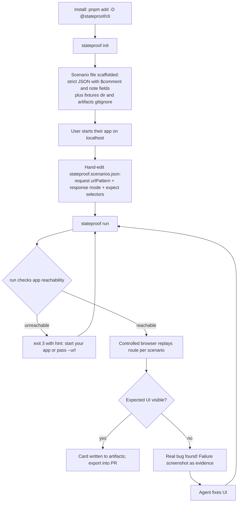
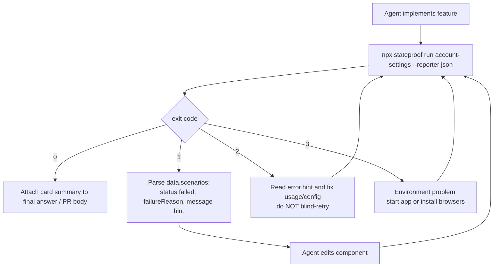
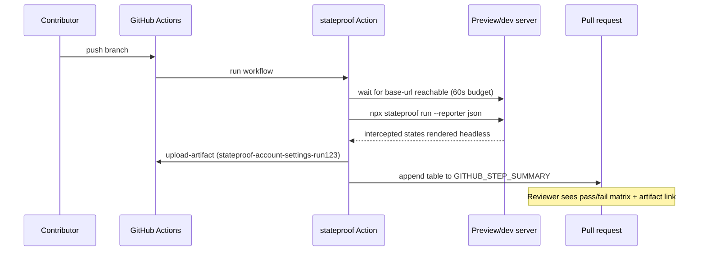

# Stateproof — User Flows

> Every way a human or an agent touches Stateproof, from first install to PR evidence. Expands PRD §5–§7 into implementable flows with UX states, decision points, and failure handling.

| Field | Value |
|---|---|
| Status | Active |
| Surfaces covered in v0.1 | CLI (R1), HTML report directory (R1) |
| Future surfaces (post-0.1) | Companion panel (R1.1), GitHub Action (R2), agent MCP bridge |
| Related docs | `contract.md` (binding), `prd.txt`, `architecture.md`, `design.md` |

---

## 1. Personas at a glance

| Persona | Environment | Success looks like |
|---|---|---|
| **P1 · AI-assisted builder ("vibe coder")** | Cursor / Claude Code + `npm run dev` | Sees the real screen break in loading/empty/error states *before* shipping; captures proof without learning Playwright. |
| **P2 · Product-minded frontend dev** | Terminal + Git + PRs | Replays saved scenarios after touching a data-dependent screen; pastes a card into the PR description. |
| **P3 · Reviewer / lead** | GitHub PR page | Reads a 10-line card that says which states were checked and clicks screenshots only where needed. |
| **P4 · Coding agent** | Shell access to the repo | Runs one command, parses JSON, fixes failures, reruns until exit 0. |

---

## 2. Golden path (the 6-step spine)

All other flows are variations of this loop:

```text
1  App running on localhost
2  stateproof run account-settings
3  GET /api/account intercepted -> forced state applied in controlled browser
4  Expected selector found at each configured viewport -> screenshot captured
5  artifacts/stateproof/account-settings/ filled: PNGs, card.md, report
6  Failure? fix -> rerun.  Success? paste card into PR.
```

Time budget (PRD G-01): after initial setup, three interactions or fewer to see any saved scenario's result.

---

## 3. Flow A — First-time vibe coder (v0.1: hand-authored JSON)

**Trigger:** An agent just generated a screen backed by `GET /api/account`; user has never used Stateproof.

> **Scenario authoring in v0.1 is by hand-editing JSON. The companion panel is post-0.1.**



### Step-level detail

| Step | What the user does | What Stateproof shows |
|---|---|---|
| Install | `pnpm add -D @stateproof/cli` | nothing |
| `init` | One command, e.g. `stateproof init --url http://localhost:5173 --route /account/settings` | Creates concise annotated JSON using `$comment` and `note` fields, plus `fixtures/`; **no reachability check**; refuses to overwrite without `--force` |
| Author | Hand-edit scenarios: pick request method + path glob, response mode (`delay` / `fixture` / `inline` / `error` / `offline`), expected CSS selector(s) | `stateproof list` validates the file without launching a browser |
| Start app | `npm run dev` | nothing — Stateproof never starts the user's app |
| Run | `stateproof run` | Reachability check (10 s budget) → controlled browser forces each state headlessly → screenshots |
| Verify | Read terminal matrix / open report directory | PASS/FAIL/ERROR per scenario × viewport; failure screenshots carry the same semantic filename |
| Export | `stateproof export --format md > pr-card.md` | Card markdown on stdout |

**Emotional goal:** "That's it? My empty state was broken and I have proof in 4 minutes."
**Anti-goals:** No account, no dashboard login, no test-framework concepts required. No companion panel in v0.1.

---

## 4. Flow B — Experienced developer, saved scenarios (R1)

**Trigger:** About to touch `/account/settings`, or reviewing someone who did.

1. Open `stateproof.scenarios.json` in repo (reviewed like code — FR-04 `note` explains intent).
2. Start app: `npm run dev`.
3. Run everything for this screen:

   ```bash
   npx stateproof run
   ```

   or target precisely:

   ```bash
   npx stateproof run account-settings          # runs ALL scenarios, only if it equals the file's name field
   npx stateproof run account-error             # runs the scenario whose id is account-error
   npx stateproof run --file custom.scenarios.json
   npx stateproof run --scenario account-error --viewport mobile
   npx stateproof run --url http://localhost:3000
   ```

4. Watch terminal matrix:

```text
account-settings · 3 scenarios × 2 viewports

PASS account-loading  desktop  3.1s   [data-state='loading']
PASS account-loading  mobile   2.9s
PASS account-empty    desktop  1.8s
FAIL account-error    mobile   15.0s  selector timeout: [data-state='error']
    artifact: artifacts/stateproof/account-settings/account-error.mobile.png
    hint: check that the error branch renders a retry control below 420px

5 passed · 1 failed · exit code 1
```

5. Fix the UI (or send the hint to an agent), rerun until exit 0.
6. Attach evidence:
   - Human path: open `artifacts/stateproof/account-settings/report/index.html`, drag screenshots into the PR.
   - Fast path: `npx stateproof export --format md` appended into the PR description.

### CLI grammar quick reference (frozen by contract §5)

| Invocation | Meaning |
|---|---|
| `stateproof init [--file <path>] [--url <baseUrl>] [--route <path>] [--force]` | Scaffold file + fixtures dir; no reachability check; overwrite requires `--force` |
| `stateproof run [ids...] [--file] [--scenario <id...>] [--viewport <name...>] [--url] [--timeout-ms <n>] [--allow-remote] [--allow-third-party] [--strict-secrets] [--reporter human\|json]` | Execute scenarios headlessly |
| `stateproof list [--file <path>] [--reporter human\|json]` | Validate + summarize without browser or reachability check |
| `stateproof export [--run <artifactDir>] [--file <scenarioFilePath>] [--format md\|json]` | Emit card from an artifact directory |

Behavior notes:

- One positional equal to the scenario file's `name` ⇒ runs all scenarios; otherwise positionals are scenario ids; unknown ids ⇒ exit 2.
- `--url` overrides the file's `baseUrl`; per-scenario `expect.timeoutMs` overrides `--timeout-ms` overrides the 15 s default.
- `--allow-remote` is required for non-loopback targets; `--allow-third-party` permits non-`baseUrl`-origin requests; `--strict-secrets` turns secret-scan warnings into failures.

### Failure-handling rules baked into UX

- A failed scenario **always** leaves a failure screenshot plus a reason string — never a silent red X.
- Selector-timeout messages include exact selector, viewport, timeout value, and next-action hint.
- App unreachable means exit code 3 with hint "start your app or pass --url", never a raw stack trace wall.

---

## 5. Flow C — Coding-agent verification loop (R1 → R2+)

**Trigger:** Developer prompts: "Build the settings screen and prove loading/empty/error states with Stateproof."



Contract details the agent relies on (mirrors architecture §4.3):

- Exactly one JSON document on stdout when `--reporter json`; all human chatter goes to stderr.
- Stable envelope: `ok`, `schemaVersion`, `type`, `data`, `error { code, message, hint }`.
- Exit codes: `0` pass, `1` scenario failure, `2` usage/config error, `3` environment error, `4` internal.
- Failure messages are written as instructions: "hint: add `[data-state='empty']` to the empty branch" beats "assertion failed".

Loop discipline: the agent iterates only on exit 1; exit 2 requires reading the hint, not retrying.

---

## 6. Flow D — Pull-request evidence via GitHub Action (R2)

**Trigger:** Contributor pushes UI change + scenario file; repo has the workflow installed.



### PR summary shape

```markdown
## Stateproof — account-settings
| Scenario        | desktop | mobile |
|-----------------|---------|--------|
| account-loading | PASS    | PASS   |
| account-empty   | PASS    | PASS   |
| account-error   | PASS    | FAIL   |

Screenshots + report: workflow artifacts (`stateproof-account-settings-run123`, retained 14 days)
```

Rules:

- Artifact names embed the scenario-file name + run id (unique per job — required by upload-artifact v4+).
- Retention short by default (7–14 days): screenshots can contain real UI data.
- The action never posts PR *comments* by default (permission-minimal; PRD FR-24).
- Failures still upload artifacts before exiting non-zero so reviewers get evidence, not silence.

---

## 7. Flow E — Reviewer consuming evidence (all releases)

1. PR opens with a Stateproof Card section (pasted manually in R1, automatic summary in R2).
2. Reviewer scans status glyphs: every row is a named state with viewport coverage.
3. Any FAIL row links to a failure screenshot showing exactly what was missing (e.g., no retry button at 390 px).
4. Reviewer requests changes citing the screenshot, or approves knowing the four canonical states were exercised.
5. Card stays in the PR description forever — evidence survives even after artifacts expire.

Language rule (PRD §16): copy says "captured" and "assertion passed"; never "fully tested" or "bug-free".

---

## 8. Cross-flow UX states & edge cases

| Situation | Behavior | Exit code |
|---|---|---|
| Scenario file missing | Error naming expected path + `stateproof init` hint | 2 |
| Schema invalid | File/line annotated list of problems; file NOT partially run | 2 |
| Duplicate scenario ids | Validation error before any browser launches | 2 |
| `urlPattern: "**/*"` | Rejected: too broad; suggest narrowing to `**/api/**` | 2 |
| App unreachable | Wait up to 10 s polling `/`; then clear environment error | 3 |
| Chromium not installed | Hint: `npx playwright install chromium` | 3 |
| All scenarios passed | Summary + artifact paths + card location | 0 |
| Some scenarios failed | Per-failure block (screenshot, reason, hint); artifacts still written | 1 |
| Unexpected crash | Short message + runId; full trace written to `artifacts/.../trace.md` | 4 |

Keyboard/a11y requirements for companion + report surfaces: full keyboard navigation, visible focus, text labels beside color status (WCAG AA per NFR §9).

---

## 9. First-session activation checklist (maps to success metric)

A new project reaches "activated" when all boxes check:

- [ ] `stateproof init` completed
- [ ] At least one scenario saved (any authoring surface)
- [ ] One successful `run` producing a screenshot
- [ ] One card exported or attached somewhere reviewable

Target from PRD §14: 40% of installers reach this within the first session; median time from `init` to first card under 10 minutes.
